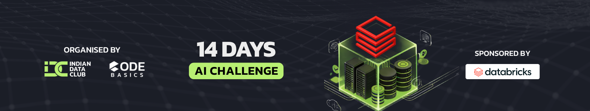

  

# Databricks 14 Days of AI Challenge

---

## Overview

This repository documents my hands-on work through the Databricks 14 Days of AI Challenge.
I used the challenge as a structured boundary to validate production-grade patterns: governance constraints, storage semantics, catalog behavior, and operational trade-offs that surface in real platforms.

Organized by Indian Data Club (IDC) and supported by Databricks and Codebasics.

---

## Repository guide

If you only read three things, start here:

- Architecture: `docs/architecture.md`
- Engineering decisions: `docs/decisions.md`
- Notebook index (day-by-day run order): `notebooks/README.md`

Screenshots and proof artifacts live in: `screenshots/README.md`

---

## Capstone project (Days 15–21)

I’m creating the capstone as a separate repository so it reads like a real project (clean structure, runbook, reproducible outputs).

Capstone repo: Coming soon

---

## Progress log (Days 0–14)

- Day 0: Environment setup and dataset onboarding
- Day 1: Platform basics and initial PySpark exploration
- Day 2: Ingestion and basic transformations (schema normalization, Oct + Nov union, minimal data quality checks)
- Day 3: PySpark transformations deep dive (joins, window functions, derived features, UDFs)
- Day 4: Delta Lake introduction (CSV to Delta, tables, schema enforcement)
- Day 5: Delta Lake advanced (MERGE upserts, time travel, idempotent ingestion, optimization attempts)
- Day 6: Medallion architecture with Delta Lake (Bronze/Silver/Gold, audit metadata, deterministic deduplication)
- Day 7: Operationalized the pipeline using Databricks Jobs with parameterized notebooks, task dependencies, and failure isolation
- Day 8: Validated Unity Catalog concepts by aligning Volumes, Delta storage, and catalog registration with controlled governance boundaries
- Day 9: Built analysis-grade datasets designed to power dashboards and downstream decision-making consistently
- Day 10: Treated performance as a design constraint, driven by access patterns and storage layout
- Day 11: ML readiness via defendable statistics, testable hypotheses, and reusable feature tables
- Day 12: Reproducible experiments with MLflow using materialized training inputs
- Day 13: Model comparison with Spark ML, feature variants, tuning, and MLflow tracking
- Day 14: AI-powered analytics (Genie + Mosaic AI concepts) integrated into the analytics workflow

---

## How to run (high level)

This repo is notebook-first and runs in Databricks.

1) Run `notebooks/day00_setup_validation.ipynb` to validate environment and dataset access
2) Run notebooks sequentially using `notebooks/README.md` as the index
3) Bronze → Silver → Gold tables are created along the way (Delta)
4) MLflow work begins in Day 12 and builds on Gold feature tables produced in Day 11

Notes:
- The environment is designed around Unity Catalog Volumes for controlled storage.
- In Community Edition, some platform features (for example certain optimizations) may be limited. The notebooks handle those constraints explicitly where relevant.

---

## Tech stack

- Platform: Databricks (Community Edition / Professional), Spark SQL, Delta Lake
- Languages: Python, SQL
- Data processing: PySpark
- Storage and table management: Delta Lake, managed tables, Volume-backed storage
- ML and experimentation: Scikit-Learn, MLflow
- Analysis: Pandas, Matplotlib

---

## Acknowledgments

Kudos to Indian Data Club (IDC), Databricks, and Codebasics for a challenge format that forces implementation and disciplined iteration.
The value comes from executing the work through a production lens, not treating the days as isolated tutorials.